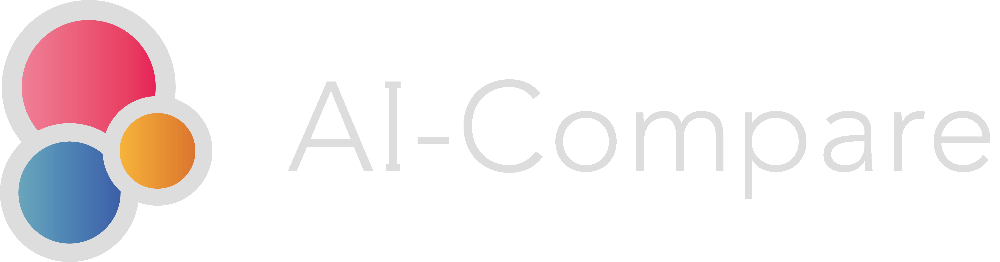

# Face_Detection-API - AI-Compare API
## Description
This repositery provides code to implement [AI-Compare Face Detection API](https://www.ai-compare.com/vision_apis/face_detection). [AI-Compare Face Detection API](https://www.ai-compare.com/vision_apis/face_detection) allows to call Face Detection APIs from Google Cloud Platform Cloud Vision, AWS Rekognition, Microsoft Azure Face API. It permits to get results from these providers and compare the results.

## What is AI-Compare ?
[AI-Compare](https://www.ai-compare.com/) is a SaaS providing APIs connected to big (AWS, GCP, etc.) and small AI providers: [object detection](https://www.ai-compare.com/vision_apis/object_detection), [OCR](https://www.ai-compare.com/vision_apis/ocr), [NLP](https://www.ai-compare.com/text_apis/sentiment_analysis/), [speech-to-text](https://www.ai-compare.com/audio_apis/speech_recognition), custom vision, etc. Our solution allows users to compare the performance of these providers APIs according to their data and use them directly via our API thus offering great flexibility and making it very easy to change supplier. In particular, we offer better performance with the "Genius" feature that cleverly combines results from multiple providers.

AI-Compare offers 2$ free credits when you [create your account for free](https://www.ai-compare.com/accounts/login/?next=/my_apis). You can then use [APIs](https://www.ai-compare.com/v1/redoc/), use the [interface](https://www.ai-compare.com/my_apis), manage your account and have access to all the APIs.

You can find APIs documentation here : https://www.ai-compare.com/v1/redoc/

## Usage
### Initialization
Enter your access token and select your API endpoint. You can get your token on your account manager [here](https://www.ai-compare.com/accounts/login/?next=/my_apis/my_account).
```python
import requests
headers = {  'Authorization': 'Bearer your API Key'}
url = 'https://www.ai-compare.com/v1/pretrained/vision/face_detection'
```
### Select parameters 
Set your file (.jpg, .png, .jpeg, .tiff), and providers APIs you want to run :
```python
payload = {'providers': '[\'google_cloud\', \'cognitives_service\', \'aws\']'}
files = [  ('files', open('Picture/example.jpg','rb'))]
```
### Get results
```python
response = requests.request("POST", url, headers=headers, data = payload, files = files)
print(response.text.encode('utf8'))
```

## Response example
<details>
<summary>

```json
[
  {
    "solution_name": "Google cloud",
    "execution_time": "0.708813",
    "result": {
      "image_path": "media/data/files/face_test.jpeg",
      "attributes_label": [
        [
          "Quality",
          "Accessories"
        ]
      ],
      "attributes_value": [
        [
          {
            "Exposed": 0.2,
            "Blurred": 0.2
          },
          {
            "headwear": 0.2
          }
        ]
      ],
      "confidences": [
        0.35867542
      ],
      "landmarks": [
        {
          "LEFT_EYE": [
            0.5593928,
            0.35563782222222223
          ],
          "RIGHT_EYE": [
            0.7493147111111111,
            0.37685453333333335
          ],
          "LEFT_OF_LEFT_EYEBROW": [
            0.4800930666666666,
            0.28822359999999997
          ],
          "RIGHT_OF_LEFT_EYEBROW": [
            0.6244671555555555,
            0.3007544622222222
          ],
          "LEFT_OF_RIGHT_EYEBROW": [
            0.7182963111111111,
            0.3118995555555556
          ],
          "RIGHT_OF_RIGHT_EYEBROW": [
            0.8179752,
            0.3369044888888889
          ],
          "MIDPOINT_BETWEEN_EYES": [
            0.6695876888888889,
            0.3506298666666667
          ],
          "NOSE_TIP": [
            0.6797081333333332,
            0.4878652444444444
          ],
          "UPPER_LIP": [
            0.6445883555555555,
            0.5621490666666666
          ],
          "LOWER_LIP": [
            0.6420255555555555,
            0.6221899555555556
          ],
          "MOUTH_LEFT": [
            0.5682549777777778,
            0.6044451111111111
          ],
          "MOUTH_RIGHT": [
            0.7088203111111111,
            0.6129685333333333
          ],
          "MOUTH_CENTER": [
            0.6439076,
            0.5986145777777777
          ],
          "NOSE_BOTTOM_RIGHT": [
            0.7014897333333334,
            0.5141742666666667
          ],
          "NOSE_BOTTOM_LEFT": [
            0.5890595555555556,
            0.4941219111111111
          ],
          "NOSE_BOTTOM_CENTER": [
            0.6512152,
            0.5210045777777778
          ],
          "LEFT_EYE_TOP_BOUNDARY": [
            0.5623617777777778,
            0.33500637333333333
          ],
          "LEFT_EYE_RIGHT_CORNER": [
            0.6094655555555556,
            0.3619852711111111
          ],
          "LEFT_EYE_BOTTOM_BOUNDARY": [
            0.5562037155555556,
            0.37223462222222226
          ],
          "LEFT_EYE_LEFT_CORNER": [
            0.5129351111111111,
            0.3470724
          ],
          "RIGHT_EYE_TOP_BOUNDARY": [
            0.7594370666666668,
            0.35611131555555553
          ],
          "RIGHT_EYE_RIGHT_CORNER": [
            0.7932376444444443,
            0.3804408
          ],
          "RIGHT_EYE_BOTTOM_BOUNDARY": [
            0.7520020888888889,
            0.39370306666666666
          ],
          "RIGHT_EYE_LEFT_CORNER": [
            0.709422,
            0.3764042666666667
          ],
          "LEFT_EYEBROW_UPPER_MIDPOINT": [
            0.5554626222222222,
            0.2737745511111111
          ],
          "RIGHT_EYEBROW_UPPER_MIDPOINT": [
            0.7756757777777777,
            0.3068927111111111
          ],
          "LEFT_EAR_TRAGION": [
            0.3470447111111111,
            0.43821248888888886
          ],
          "RIGHT_EAR_TRAGION": [
            0.8367084444444445,
            0.4644870222222222
          ],
          "FOREHEAD_GLABELLA": [
            0.6762984,
            0.30784039999999996
          ],
          "CHIN_GNATHION": [
            0.6263550666666666,
            0.7220664444444443
          ],
          "CHIN_LEFT_GONION": [
            0.38817488888888885,
            0.6194026222222222
          ],
          "CHIN_RIGHT_GONION": [
            0.7651971999999999,
            0.6562912444444444
          ]
        }
      ],
      "emotions": [
        {
          "joy": 1,
          "sorrow": 1,
          "angry": 1,
          "surprise": 1
        }
      ],
      "poses": [
        {
          "Roll": 5.686333,
          "Pan": 14.24138,
          "Tilt": 3.5769544
        }
      ],
      "x_mins": [
        0.3422222222222222
      ],
      "x_maxs": [
        0.9066666666666666
      ],
      "y_mins": [
        0.1288888888888889
      ],
      "y_maxs": [
        0.7333333333333333
      ]
    },
    "api_response": {
      "responses": [
        {
          "faceAnnotations": [
            {
              "boundingPoly": {
                "vertices": [
                  {
                    "x": 55
                  },
                  {
                    "x": 216
                  },
                  {
                    "x": 216,
                    "y": 182
                  },
                  {
                    "x": 55,
                    "y": 182
                  }
                ]
              },
              "fdBoundingPoly": {
                "vertices": [
                  {
                    "x": 77,
                    "y": 29
                  },
                  {
                    "x": 204,
                    "y": 29
                  },
                  {
                    "x": 204,
                    "y": 165
                  },
                  {
                    "x": 77,
                    "y": 165
                  }
                ]
              },
              "landmarks": [
                {
                  "type": "LEFT_EYE",
                  "position": {
                    "x": 125.86338,
                    "y": 80.01851,
                    "z": 0.0002937317
                  }
                },
                {
                  "type": "RIGHT_EYE",
                  "position": {
                    "x": 168.59581,
                    "y": 84.79227,
                    "z": 11.708078
                  }
                },
                {
                  "type": "LEFT_OF_LEFT_EYEBROW",
                  "position": {
                    "x": 108.02094,
                    "y": 64.85031,
                    "z": 0.9391651
                  }
                },
                {
                  "type": "RIGHT_OF_LEFT_EYEBROW",
                  "position": {
                    "x": 140.50511,
                    "y": 67.669754,
                    "z": -4.776925
                  }
                },
                {
                  "type": "LEFT_OF_RIGHT_EYEBROW",
                  "position": {
                    "x": 161.61667,
                    "y": 70.1774,
                    "z": 0.8897209
                  }
                },
                {
                  "type": "RIGHT_OF_RIGHT_EYEBROW",
                  "position": {
                    "x": 184.04442,
                    "y": 75.80351,
                    "z": 20.882318
                  }
                },
                {
                  "type": "MIDPOINT_BETWEEN_EYES",
                  "position": {
                    "x": 150.65723,
                    "y": 78.89172,
                    "z": -3.3756657
                  }
                },
                {
                  "type": "NOSE_TIP",
                  "position": {
                    "x": 152.93433,
                    "y": 109.76968,
                    "z": -19.40564
                  }
                },
                {
                  "type": "UPPER_LIP",
                  "position": {
                    "x": 145.03238,
                    "y": 126.48354,
                    "z": -10.307529
                  }
                },
                {
                  "type": "LOWER_LIP",
                  "position": {
                    "x": 144.45575,
                    "y": 139.99274,
                    "z": -8.050627
                  }
                },
                {
                  "type": "MOUTH_LEFT",
                  "position": {
                    "x": 127.85737,
                    "y": 136.00015,
                    "z": -3.6522136
                  }
                },
                {
                  "type": "MOUTH_RIGHT",
                  "position": {
                    "x": 159.48457,
                    "y": 137.91792,
                    "z": 5.713644
                  }
                },
                {
                  "type": "MOUTH_CENTER",
                  "position": {
                    "x": 144.87921,
                    "y": 134.68828,
                    "z": -7.4288225
                  }
                },
                {
                  "type": "NOSE_BOTTOM_RIGHT",
                  "position": {
                    "x": 157.83519,
                    "y": 115.68921,
                    "z": 0.617728
                  }
                },
                {
                  "type": "NOSE_BOTTOM_LEFT",
                  "position": {
                    "x": 132.5384,
                    "y": 111.17743,
                    "z": -5.8547144
                  }
                },
                {
                  "type": "NOSE_BOTTOM_CENTER",
                  "position": {
                    "x": 146.52342,
                    "y": 117.22603,
                    "z": -9.767664
                  }
                },
                {
                  "type": "LEFT_EYE_TOP_BOUNDARY",
                  "position": {
                    "x": 126.5314,
                    "y": 75.376434,
                    "z": -2.5105782
                  }
                },
                {
                  "type": "LEFT_EYE_RIGHT_CORNER",
                  "position": {
                    "x": 137.12975,
                    "y": 81.446686,
                    "z": 2.551581
                  }
                },
                {
                  "type": "LEFT_EYE_BOTTOM_BOUNDARY",
                  "position": {
                    "x": 125.145836,
                    "y": 83.75279,
                    "z": -0.95835686
                  }
                },
                {
                  "type": "LEFT_EYE_LEFT_CORNER",
                  "position": {
                    "x": 115.4104,
                    "y": 78.09129,
                    "z": 1.7634058
                  }
                },
                {
                  "type": "RIGHT_EYE_TOP_BOUNDARY",
                  "position": {
                    "x": 170.87334,
                    "y": 80.125046,
                    "z": 9.593618
                  }
                },
                {
                  "type": "RIGHT_EYE_RIGHT_CORNER",
                  "position": {
                    "x": 178.47847,
                    "y": 85.59918,
                    "z": 18.622738
                  }
                },
                {
                  "type": "RIGHT_EYE_BOTTOM_BOUNDARY",
                  "position": {
                    "x": 169.20047,
                    "y": 88.58319,
                    "z": 11.135572
                  }
                },
                {
                  "type": "RIGHT_EYE_LEFT_CORNER",
                  "position": {
                    "x": 159.61995,
                    "y": 84.69096,
                    "z": 9.167095
                  }
                },
                {
                  "type": "LEFT_EYEBROW_UPPER_MIDPOINT",
                  "position": {
                    "x": 124.97909,
                    "y": 61.599274,
                    "z": -4.5308714
                  }
                },
                {
                  "type": "RIGHT_EYEBROW_UPPER_MIDPOINT",
                  "position": {
                    "x": 174.52705,
                    "y": 69.05086,
                    "z": 8.219513
                  }
                },
                {
                  "type": "LEFT_EAR_TRAGION",
                  "position": {
                    "x": 78.08506,
                    "y": 98.59781,
                    "z": 47.999016
                  }
                },
                {
                  "type": "RIGHT_EAR_TRAGION",
                  "position": {
                    "x": 188.2594,
                    "y": 104.50958,
                    "z": 76.022705
                  }
                },
                {
                  "type": "FOREHEAD_GLABELLA",
                  "position": {
                    "x": 152.16714,
                    "y": 69.26409,
                    "z": -3.5282402
                  }
                },
                {
                  "type": "CHIN_GNATHION",
                  "position": {
                    "x": 140.92989,
                    "y": 162.46495,
                    "z": -3.0752068
                  }
                },
                {
                  "type": "CHIN_LEFT_GONION",
                  "position": {
                    "x": 87.33935,
                    "y": 139.36559,
                    "z": 28.25176
                  }
                },
                {
                  "type": "CHIN_RIGHT_GONION",
                  "position": {
                    "x": 172.16937,
                    "y": 147.66553,
                    "z": 50.897503
                  }
                },
                {
                  "position": {
                    "x": 113.88645,
                    "y": 112.12285,
                    "z": -0.5633178
                  }
                },
                {
                  "position": {
                    "x": 173.82903,
                    "y": 118.704544,
                    "z": 15.733902
                  }
                }
              ],
              "rollAngle": 5.686333,
              "panAngle": 14.24138,
              "tiltAngle": 3.5769544,
              "detectionConfidence": 0.35867542,
              "landmarkingConfidence": 0.22347595,
              "joyLikelihood": "VERY_UNLIKELY",
              "sorrowLikelihood": "VERY_UNLIKELY",
              "angerLikelihood": "VERY_UNLIKELY",
              "surpriseLikelihood": "VERY_UNLIKELY",
              "underExposedLikelihood": "VERY_UNLIKELY",
              "blurredLikelihood": "VERY_UNLIKELY",
              "headwearLikelihood": "VERY_UNLIKELY"
            }
          ]
        }
      ]
    },
    "found_objects": "Success"
  }
]
```

</details>

## FAQ
Here you can access to AI-Compare [FAQ](https://www.ai-compare.com/faq/).

## Use cases
We provides on our website some [use cases examples for Vision APIs](https://www.ai-compare.com/use_cases_vision/)

## Contact
If you have any question or request, you can contact us at contact@ai-compare.com

## Terms of use
You can access to our terms [here](https://www.ai-compare.com/terms/) on our website.

#

